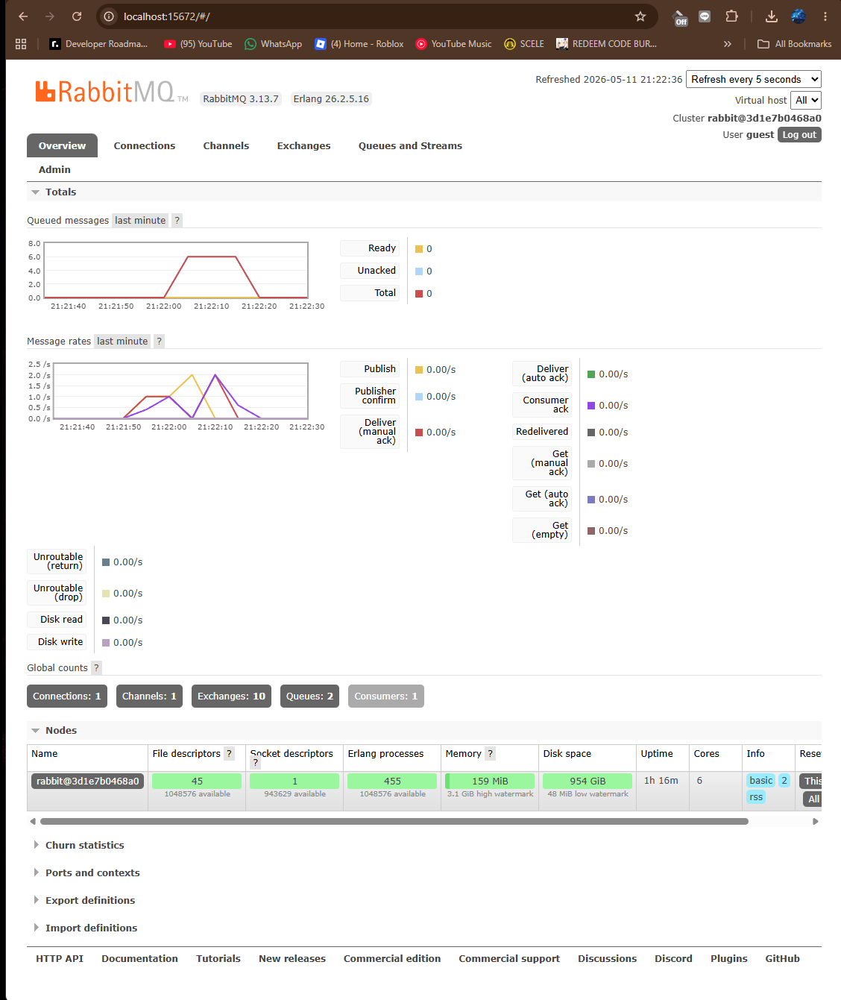
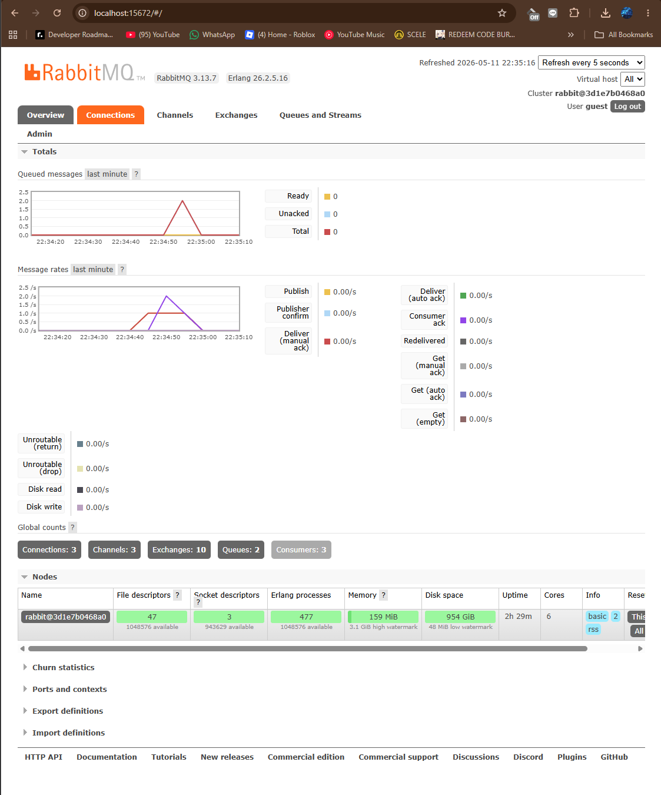

# Reflection

### What is amqp?
- amqp simpelnya adalah protokol standar yang dipakai untuk komunikasi asynchronous antar service

### What does it mean? guest:guest@localhost:5672 , what is the first guest, and what is the second guest, and what is localhost:5672 is for?
- amqp ini adalah protol message parsing dimana amqp ini menjamin agar pesan tidak hilang ditengah jalan. URL tersebut adalah sebuah URL koneksi yang digunakan untuk terhubung dengan message broker atau RabbitMQ yang sedang kita pakai di tutorial ini. guest pertama menyatakan username default user untuk mengakses RabbitMQ. guest kedua adalah password default untuk username yang kita gunakan. `localhost:5672` untuk menyatakan RabbitMQ sedang menggunakan di port mana untuk listen koneksi yang masuk dari 

### Slow Subscriber

Terjadi bottleneck karena subscriber dipaksa menunggu setiap harus memproses event. publisher berjalan lebih cepat dari subscriber dan ketika subscriber tidak bisa memproses secepat itu, maka akan ditampung terlebih dahulu di queue. Pada skenario saya, saya memiliki queue sebanyak 6 karena delay antar run publish yang 1 dengan yang lainnya ada beberapa detik dimana pada delay tersebut queue tersebut dilayani maka peak saya hanya ada di 6 queue saja.

### Running at least three subscribers

terjadi penurunan dari 1 subscriber dimana kalau dijalankan 3 subscriber turun menjadi 2 queue. ini terjadi karena sekarang setiap 1 detik, rabbitmq mengeksekusi 3 queue jadi seharusnya turun 3x dari awal.